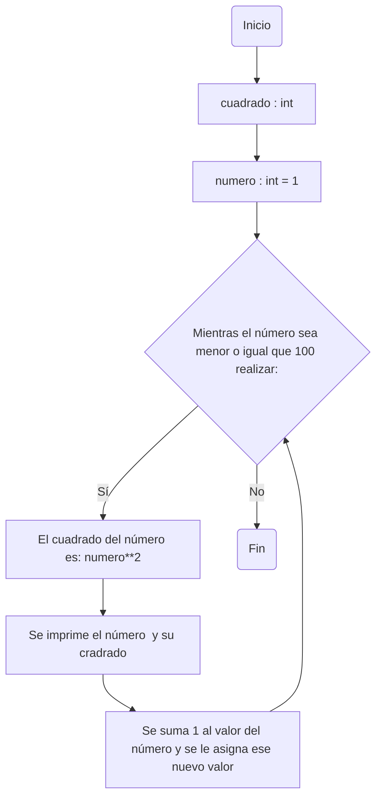
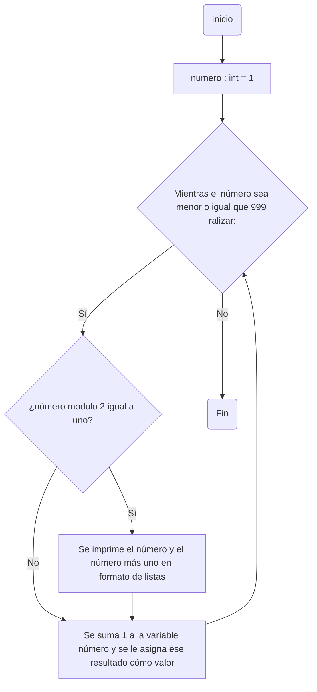
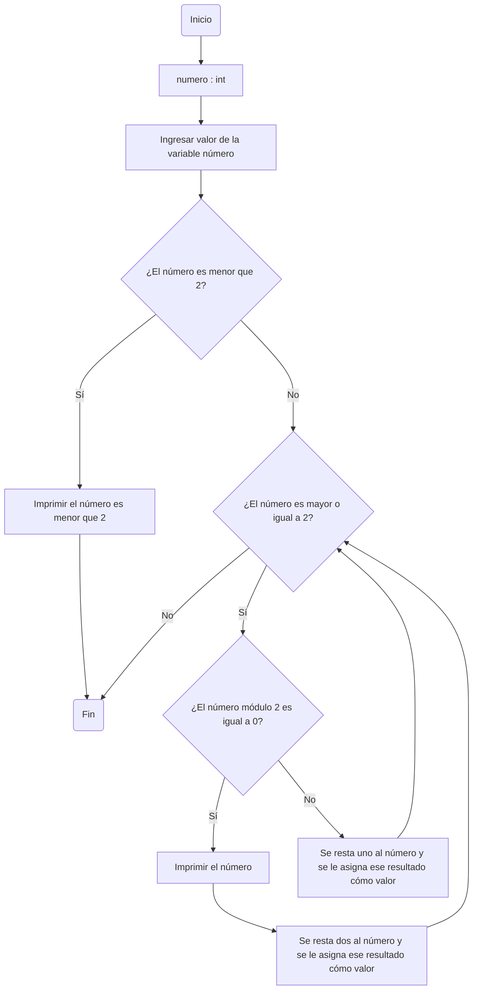

# Reto 7
_El siguiente repositorio muestra la solución a los puntos del reto 7_

## 1. Imprimir un listado con los números del 1 al 100 cada uno con su respectivo cuadrado

```python
# Se declara variables e inicializa variable numero
cuadrado : int 
numero : int = 1

while (numero < 100 + 1):
    cuadrado= numero ** 2

    # Se imprime el número y su cuadrado
    print("El cuadrado de " + str(numero) + " es " + str(cuadrado))

    numero += 1
```
### Diagrama de flujo punto 1

## 2.  Imprimir un listado con los números impares desde 1 hasta 999 y seguidamente otro listado con los números pares desde 2 hasta 1000

```python
# Se declara e inicializa variable
numero : int = 1

while (numero <= 999):
    
    # Si número modulo 2 igual a uno, se imprime el número y el siguiente, 
    # el cuál debe ser par
    if numero % 2 == 1:
        print("{:<10} {:<10}".format(numero, numero+1))  

    numero += 1 
```

### Diagrama de flujo punto 2



## 3.  Imprimir los números pares en forma descendente hasta 2 que son menores o iguales a un número natural n ≥ 2 dado

```python
# Se declara variable
numero : int 
numero = int(input("Ingrese un número"))

# Se define que no hay pares menores que 2
if numero < 2:
        print("El número es menor que 2")

while (numero >= 2):
    
    # Si número módulo 2 es 0, el número es par, 
    # luego se resta 2 para seguir el otro par menor que número
    if numero % 2 == 0:
        print(numero) 
        numero -= 2

    # Si numero no es par se resta uno
    else:
        numero -= 1
```

### Diagrama de flujo punto 3



## 4. En 2022 el país A tendrá una población de 25 millones de habitantes y el país B de 18.9 millones. Las tasas de crecimiento anual de la población serán de 2% y 3% respectivamente. Desarrollar un algoritmo para informar en que año la población del país B superará a la de A

```python
# Se declara e inicializa variables

paisA : int = 25e6
paisB : int = 18.9e6
año : int = 2022

# Mientras la población de paisA sea mayor o igual a la de paisB, 
# se calcula proyección de población
while (paisA >= paisB):
    paisB += paisB * 3 / 100
    paisA += paisA * 2 / 100
    año += 1

# Se imprime el año en el que paisB tedrá más población que paisA
print("En el año " + str(año) + " el país B tendrá más población que el país A")

# Se imprime población de paisB para ese año
print("La población del país B sera " + str(int(paisB)))

# Se imprime población de paisA para ese año
print("La población del país A sera " + str(int(paisA)))
```

## 5. Imprimir el factorial de un número natural n dado

```python
# Se declaran variables e inicializa variable factor y producto

factor : int = 1
producto : int = 1
numero = int(input("Ingrese un número"))

if numero >= 0:

    # Se ejecuta ciclo while hasta el factor sea mayor que el numero
    while numero >= factor:
        producto *= factor
        factor += 1
    print("El factorial de " + str(numero) + " es " +str(producto))

# Si se ingresa un número negativo, se imprime mensaje
else:
    print("Los número negativos no tienen factorial")
```

## 6. Implementar un algoritmo que permita adivinar un número dado de 1 a 100, preguntando en cada caso si el número es mayor, menor o igual

```python
import random

# Se declaran variables.
numero : int 
numero = int(input("Adivine el número"))

# Se establece rango del número aleatorio.
numero_aleatorio = random.randint(1, 100)

# Se ejecuta ciclo while hasta que no se adivine el número.
while numero != numero_aleatorio:
    if numero > numero_aleatorio:
        print("El número es menor")
        numero = int(input("Adivine el número"))
    else:
        print("El número es mayor")
        numero = int(input("Adivine el número"))

# Se imprime el mensaje si se adivina el número.    
print("Felicidades, el número es igual, adivinaste")
```

## 7. Implementar un programa que ingrese un número de 2 a 50 y muestre sus divisores

```python
# Se declaran variables
numero : int
numero = int(input("Ingrese un número entre 2 y 50 incluyendo estos dos"))

# Se asigna a variable divisor el valor de la variable numero
divisor : int = numero

# Se establece rango de números a mostrar divisores
if 2 <= numero and numero <= 50:

    # Se ejecuta while hasta encontrar los divisores
    while divisor > 0:
        if divisor != 0 and numero % divisor == 0:
            print(str(divisor) + " es divisor de " + str(numero) )
            divisor -= 1
        else:
            divisor -= 1

# Si el numero no está en el rango se imprime mensaje
else:
    print("El número no se encuentra entre 2 y 50 incluyendo estos dos")
```

## 8. Implementar el algoritmo que muestre los números primos del 1 al 100. 
###**Nota:** use funciones

```python
# Se define función ejecutarNumero
def ejecutarNumero(numero : float):

  # Se ejecuta ciclo while hasta que número sea menor que 2
  while numero >= 2:
   evaluarNumeroSiPrimo(numero)
   numero -= 1 

# Se define función evaluarNumeroSiPrimo
def evaluarNumeroSiPrimo(numero : float):
  
  # Se determina si el número es primo
  modulo : float = 2
  while numero % modulo != 0:
    modulo += 1
  if modulo == numero:
        print(numero)

# Se llama a función ejecutarNumero y se declara e inicializa variable número
if __name__ == "__main__":
  numero : float = 100
Numerosprimos = ejecutarNumero(numero)         
```
